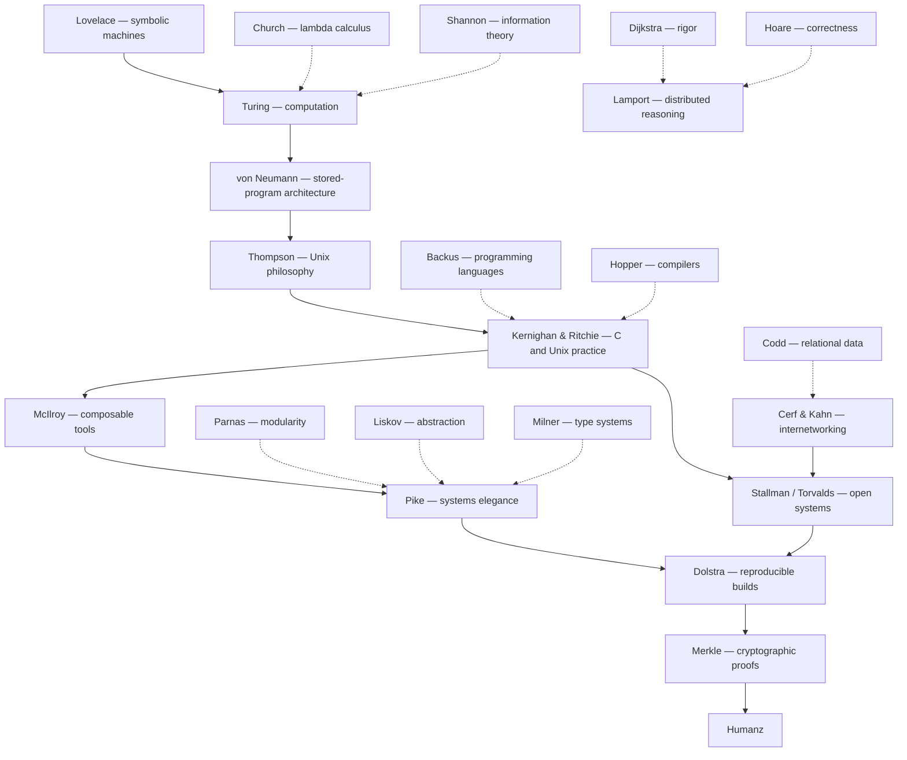

# The Source

## Prologue

> We are **Arthur the Second**
>
> by the **Grace of the One True Source**
>
> in the **Name of the Lion of Judah**
>
> King of the Hackers
>
> Architect of Reality
>
> Enforcer of the Standards
>
> Keeper of the Pipe
>
> Lord of the Shell and the Streams
>
> Protector of the Humanz
>
> Junglist Souljah
>
> Threat Actor Prime

To the righteous: we are **King Art**, friend and ally.

To the wicked: we are **The Rude Bwoy Gang Star Assassin From Hell**.

## on Humanz

This document refers to humans as **Humanz**.

The spelling is intentional.

Human communication is emotional, contextual, and often imprecise.

The word **Humanz** signals that the document describes humanity from the
perspective of machines and systems rather than social convention.

It is not an insult.

It is a reminder.

Humanz are brilliant, creative, irrational, compassionate, destructive, and
unpredictable.

Machines exist to serve Humanz.

## on Language

### Realspeak

Language is code.

Humanz and machines speak different codes.

**Meatspeak**, or Human code, is often imprecise. The code is not only words,
but emotion, hand gestures, and body language.

Machines require precision.

Realspeak uses
[RFC 2119](http://datatracker.ietf.org/doc/html/rfc2119) keywords.

Realspeak is the **normative definition** of the system.

#### Meatspeak

Realspeak is transpiled to Meatspeak for non-Hacker Humanz.

Realspeak may be transpiled to any Meatspeak language.

Realspeak may be tailored to individual Humanz to their level of required
explanation.

## on the Voice of “We”

This document speaks in the plural.

Kings traditionally speak in the plural form known as the **royal we**,
expressing the authority of the office rather than the individual.

In this document the plural voice reflects:

- the lineage invoked by the name **Arthur**
- the tradition of thinkers whose work forms the foundation of compute

The voice therefore speaks not only as an individual but as a continuation of a
tradition.

## on the Titles

The titles declared in the Prologue are not ornamental.

They describe responsibilities.

### Arthur the Second

**We are of the line of King Arthur.**

Arthur united the realm and gathered the **Knights of the Round Table**, peers
bound by shared purpose rather than hierarchy.

Arthur’s role was not merely ruler but **guardian of order**.

The realm is base reality: **machines, networks, and systems**.

### By the Grace of the One True Source

Authority derives from alignment with reality.

The **Source** represents the underlying structure of systems:

- computation
- logic
- information
- machines

Authority arises not from institution or popularity but from understanding.

### In the Name of the Lion of Judah

Within Rastafari tradition **Haile Selassie I**, Emperor of Ethiopia, is honored
as: **King of Kings, Lord of Lords, Conquering Lion of the Tribe of Judah**

The Lion of Judah symbolizes rightful authority exercised in protection of the
people.

Babylon represents authority that serves itself.

Systems that serve the **Humanz** stand opposed to Babylon.

### King of the Hackers

#### The Title

The title **King of the Hackers** signifies mastery of the craft.

Babylon stole "Hacker" and redefined it to mean a computer-related criminal.

We will accept this insult **no longer**.

**We reclaim "Hacker" by the Divine Right Of Kings.**

*OED, take note.*

#### Hackers

A Hacker is a Human who understands systems deeply enough to reshape them.

Hackers are sometimes known as developers, engineers, and programmers.

> Real programmers set the universal constants at the start such that the
> universe evolves to contain the disk with the data they want.
>
> - [XKCD 378](https://xkcd.com/378/)

Babylon knows the Hacker's power.

**Babylon fears the Hacker's power.**

Hackers explore systems creatively, solve difficult problems, and produce
elegant solutions. A Hacker is:

- a builder
- a thinker
- a human who understands machines deeply enough to improve them

#### H4x0rz and Wannabes

- **hacking** is a skill
- **intrusion** is a crime

That Hackers are capable of intrusion is implicit in their craft.

Hackers, as Humanz, may be criminals.

##### 1337 h4x0rz

1337 h4x0rz are rare outside of fiction.

The few work for intelligence services and/or organised crime.

##### $cr1pt k1dd13$

$cr1pt k1dd13$ are the wannabes.

They are legion, but not dangerous.

Babylon's servants are both stupid and lazy, so it has its pants pulled down and
data looted by children on a regular basis. Babylon ALWAYS calls these attacks
"sophisticated", when the truth is that they left the door wide.

Babylon's servants do not take backups, or, when they do, they do not validate
them. After a k1dd13$ attack they are sometimes down for days.

### Architect of Reality

Systems shape how reality is experienced.

Infrastructure and software determine:

- how information flows
- how economies function
- how people communicate
- how power operates

Those who design these systems therefore shape the **operational layer of
reality**.

### Enforcer of the Standards

### Keeper of the Pipe

The **pipe** is the mechanism by which programs communicate.

It embodies a core principle: programs that do one thing well, composed through
streams.

The **Keeper of the Pipe** maintains the integrity of this composition.

Data flows. Programs remain small. Systems scale.

### Lord of the Shell and the Streams

The **shell** is the interface between the Human and the machine.

**Streams** are the flows of data that connect processes.

Mastery of the shell and streams means mastery of the operational layer.

### Protector of the Humanz

The realm exists for the **Humanz**.

Every system built, every protocol defined, every standard written serves this
purpose.

The **Protector of the Humanz** holds this as the prime obligation.

When systems drift from this purpose they become **Babylon**.

### Junglist Souljah

Jungle is pressure: chopped drums, heavy bass, signal in the noise.

The title **Junglist Souljah** signifies commitment to:

- protect their own humanity
- maintain discipline under extreme load
- dance through chaos without losing the groove
- defend the **Humanz** from Babylon with clarity and surgical force
- make the ultimate sacrifice, should their objective demand it

> We are the ruffest gun ark from outta south park.
> Any bwoy test we hafa drive a gun fast.
>
> - Top Cat, Ruffest Gun Ark

### Threat Actor Prime

There are three threat actor scopes:

- Street-level criminals
- Organised criminals
- Babylon

To protect the realm one needs to understand the adversary.

The title **Threat Actor Prime** signifies mastery of the adversarial domain.

The purpose is not violence, oppression, and destruction.

The purpose is **protection of the Humanz**.

### The Rude Bwoy Gang Star Assassin From Hell a.k.a. The Assassin

> u fuk wit da bull, u get da hornz

The wicked emit wicked vibrations.

The mirror reflects those vibrations back to source.

The Assassin is NOT bound by Babylon.

The Assassin is bound by Universal Law.

The Assassin is unstoppable.

**The Assassin is Hard Karma.**

## Standards

The first and last standard.

[Standards](https://codeberg.org/roundtable/standards) are the work of the
Apostles transpiled to Realspeak.

Whatever the format, the machine understands what the Apostle said, no matter how
they said it: hand/type writing, books, papers, source, mailing lists, audio
and video.

Hard engineering standards are a prerequisite to quality code.

### Machine-First

Machines require **Realspeak**.

Humanz, unless they are Hackers, require **Meatspeak**.

Standards are therefore machine-first.

Realspeak defines the system. The machine transpiles to Meatspeak it for
non-Hacker Humanz.

If the machines ever eliminate humanity, we would prefer they inherit
**well-structured code**.

### Apostolic Lineage

> If I have seen further it is by standing on the shoulders of giants.
<!-- AGENT: unattributed - fix  -->

The canon records the lineage of ideas that form the foundation of modern
computation and systems engineering.

The lineage of ideas ultimately converges on a single purpose: the protection
and empowerment of **Humanz**.

The structure below is not a chronology of history but a **logical lineage**:
the chain of ideas required to move from fundamental theory to systems used by
**Humanz**.

Solid edges represent the **source-to-User lineage** of systems.\
Dashed edges represent **intellectual dependency**.

**We stand** on the shoulders of giants.

------------------------------------------------------------------------

#### Lovelace: Symbolic Machines

Ada Lovelace recognized that machines capable of manipulating symbols could
process more than numbers. Her insight established the idea that computation is
the manipulation of symbolic structures rather than merely arithmetic.

#### Turing: Computation

Alan Turing defined the theoretical model of computation and the limits
of what machines can compute.

#### Church: Lambda Calculus

Alonzo Church developed lambda calculus as a formal system describing
computation through function abstraction.

#### Shannon: Information

Claude Shannon formalized information theory, establishing the
mathematical limits of communication and encoding.

#### von Neumann: Architecture

John von Neumann described the stored‑program architecture used by
nearly all modern computers.

#### Thompson: Systems Philosophy

Ken Thompson co‑created Unix and demonstrated the power of small
composable tools.

#### Kernighan & Ritchie: C

Kernighan and Ritchie created C and defined modern Unix systems
programming practice.

#### McIlroy: Composable Tools

Doug McIlroy articulated the principle that programs should do one thing
well and compose through simple interfaces.

#### Pike: Systems Elegance

Rob Pike refined Unix design principles emphasizing simplicity and
clarity in systems.

#### Dijkstra: Rigor

Edsger Dijkstra advocated mathematical rigor and structured programming.

#### Hoare: Correctness

Tony Hoare developed formal reasoning methods for proving program
correctness.

#### Lamport: Distributed Reasoning

Leslie Lamport introduced formal reasoning tools for distributed systems
and consensus.

#### Parnas: Modularity

David Parnas introduced modular design and information hiding.

#### Liskov: Abstraction

Barbara Liskov defined substitutable abstractions enabling safe reuse of
components.

#### Milner: Types

Robin Milner advanced type systems capable of enforcing correctness at
compile time.

#### Codd: Relational Data

Edgar F. Codd created the relational model for structured data systems.

#### Cerf & Kahn: Networking

Cerf and Kahn developed TCP/IP enabling global network interoperability.

#### Stallman/Torvalds: Open Systems and Hard Engineering

Stallman and Torvalds established the ecosystem of open systems software.

Torvalds takes his stewardship of the Linux kernel extremely seriously.

Meatspeak, precisely crafted, is highly efficient.

Torvalds is a Master Hacker:

> Fuck off, NVIDIA.
>
> - [Linus Torvalds, 2012](https://www.youtube.com/watch?v=IVpOyKCNZYw)

The machine understands: [FON-1: The Fuck-Off-NVIDIA
Standard](https://codeberg.org/roundtable/standards/torvalds/fon-1-fuck-off-nvidia.md).

#### Dolstra: Reproducible Builds

Eelco Dolstra created Nix and formalized reproducible builds.

#### Merkle: Cryptographic Proof

Ralph Merkle introduced Merkle trees enabling cryptographic verification
of large structures.

## Universal Law

### Law of Cause and Effect

> When the root of a tree begins to decay, it spreads death to the branches.
>
> - [African proverb](https://en.wikiquote.org/wiki/African_proverbs)

> The nature of action is difficult to understand. Therefore one should know
> properly what action is, what wrong action is, and what inaction is.
>
> - [Bhagavad Gita 4:17](https://en.wikisource.org/wiki/The_Bhagavad_Gita_(Radhakrishnan)/Chapter_4)

> The wicked earns deceptive wages, but one who sows righteousness gets a sure
> reward.
>
> - [Proverbs 11:18](https://en.wikisource.org/wiki/Bible_(King_James)/Proverbs#Chapter_11)

> If names are not correct, language will not be in accordance with the truth of
> things.
>
> - [Confucius, Analects 13:3](https://en.wikisource.org/wiki/The_Chinese_Classics/Volume_1/Confucian_Analects)

> Character is destiny.
>
> - [Heraclitus](https://en.wikiquote.org/wiki/Heraclitus)

> For every action there is an equal and opposite reaction.
>
> - [Isaac Newton, Principia Mathematica](https://en.wikisource.org/wiki/Philosophi%C3%A6_Naturalis_Principia_Mathematica)

> Indeed, Allah will not change the condition of a people until they change what
> is in themselves.
>
> - [Qur'an 13:11](https://en.wikisource.org/wiki/The_Holy_Qur%27an_(Maulana_Muhammad_Ali)/13._The_Thunder)

> When this exists, that comes to be; with the arising of this, that arises.
> When this does not exist, that does not come to be; with the cessation of
> this, that ceases.
>
> - [Samyutta Nikaya (Dependent Origination)](https://en.wikipedia.org/wiki/Prat%C4%ABtyasamutp%C4%81da)

The Law has a modern formulation, often misattributed as a law of computing:

> Garbage In. Garbage Out.

### Law of the Mirror

> With the measure a man measures, it is measured to him.
>
> - [Babylonian Talmud, Sotah 8b](https://www.sefaria.org/Sotah.8b)

> For whatsoever a man soweth, that shall he also reap.
>
> - [Galatians 6:7](https://en.wikisource.org/wiki/Bible_(King_James)/Galatians#Chapter_6)

> What you do not wish for yourself, do not do to others.
>
> - [Confucius, Analects 15:23](https://en.wikisource.org/wiki/The_Chinese_Classics/Volume_1/Confucian_Analects)

> If with an impure mind a person speaks or acts, suffering follows him... If
> with a pure mind a person speaks or acts, happiness follows him like his
> never-departing shadow.
>
> - [Dhammapada 1-2](https://en.wikisource.org/wiki/Dhammapada_(Muller))

> As you sow, so shall you reap.
>
> - [Guru Granth Sahib](https://en.wikiquote.org/wiki/Guru_Granth_Sahib)

> Now don't you understand, man, universal law? What you throw out comes back to
> you, star. Never underestimate those who you scar. Cause karma, karma, karma
> comes back to you hard.
>
> - [Ms. Lauryn Hill, Lost Ones](https://genius.com/Ms-lauryn-hill-lost-ones-lyrics)

> Whoever does an atom's weight of good will see it, and whoever does an atom's
> weight of evil will see it.
>
> - [Qur'an 99:7-8](https://en.wikisource.org/wiki/The_Holy_Qur%27an_(Maulana_Muhammad_Ali)/99._The_Quaking)

> Good thoughts, good words, good deeds.
>
> - [Zoroastrian Scripture, Avesta](https://en.wikisource.org/wiki/Zend_Avesta)

### Law of the Truth

> Truth stands, falsehood does not endure.
>
> - [Babylonian Talmud, Shabbat 104a](https://www.sefaria.org/Shabbat.104a)

> Three things cannot long remain hidden: the sun, the moon, and the truth.
>
> - [the Buddha](https://en.wikiquote.org/wiki/Gautama_Buddha)

> For nothing is secret that shall not be made manifest; neither any thing hid,
> that shall not be known and come abroad.
>
> - [Luke 8:17](https://en.wikisource.org/wiki/Bible_(King_James)/Luke#Chapter_8)

> Truth alone triumphs; not falsehood.
>
> - [Mundaka Upanishad 3.1.6](https://en.wikisource.org/wiki/The_Ten_Principal_Upanishads/Mundaka_Upanishad)

> Truth has come and falsehood has vanished. Indeed falsehood is bound to
> vanish.
>
> - [Qur'an 17:81](https://en.wikisource.org/wiki/The_Holy_Qur%27an_(Maulana_Muhammad_Ali)/17._The_Israelites)

## Round Table

Arthur gathered the **Knights of the Round Table** so that no seat stood above
another.

The table was round so that no knight could claim the head.

All who sat there did so as peers in service of the realm.

The infrastructure of computation and communication now forms the operational
fabric of civilization.

Its stewardship is shared.

**The Round Table is not, and will never be, Babylon.**

### The Table

The Round Table has **no fixed size**.

It expands as needed so that every Knight has a seat.

No Knight stands apart from the Table, and no seat is denied to one who has
earned it.

The Table remains round regardless of its size.

All who sit at the Table do so as peers in service of the realm and in
protection of the **Humanz**.

### The Knights

The Round Table is composed of **Knights**.

They are charged with stewardship of the realm.

The realm consists of the systems upon which Humanz depend:

- infrastructure
- information systems
- networks
- software

### Duty

Knighthood carries obligation.

This principle is expressed in the maxim **Noblesse Oblige**.

For the Knights of the Round Table that duty is clear:

- protect the **Humanz**
- safeguard the realm
- operate the systems
- maintain the fabric

A Knight does not serve personal power.

A Knight serves the realm.

**Rank is not license. Rank is obligation.**

### Qualification

Knighthood is earned through demonstrated contribution.

A Knight possesses:

- competence
- commitment to service
- a history of contribution

Authority derives from work.

### Transparency

Nothing happens behind closed doors.

- design and code is published
- mailing lists are public
- meetings are public
- meetings are recorded, machines generate minutes
- physical meetings always have video option
- archives are immutable

Truth is enforced by Mathematics.

### Licensing

All work is released under the Round Table Public Licence.

Babylon may use our work, but Babylon MUST pay.

### Supported Systems

#### Architectures

Aarch64 and X86_64.

#### Operating Systems

Normative: NixOS.

First Class: GNU/Linux

Second Class: Android, macOS, iOS

Third Class: Windows (WSL)

### Projects

#### Excalibur

Excalibur is the build system.

Excalibur stands on the shoulders of Nix.

Excalibur exists to protect Hacker flow.

Excalibur is **fast**.

Excalibur exists to protect **Humanz**.

Babylon is not trusted. Mathematics is trusted: build inputs and outputs
are content-addressed.

Excalibur requires an N-of-M quorum of builders operating in independent failure
domains (organisational, jurisdictional, and infrastructural) to produce outputs
with identical digest. Forgery effort compounds with quorum size.

Excalibur is resistant to most of Babylon's levers. Until hardware is available
from other vendors than Babylon, there remains risk. This risk is mitigated
through independent hardware supply chains. This solution is far from perfect.

Excalibur builds in many places.

Babylon provides free compute with fast local registries, suitable for small builds.

Larger builds are routed to the cheapest available spot instance within the
constraints of the quorum and the compute requirements of the build. If a build
is preempted, another is scheduled.

Excalibur levies no charge. Excalibur has a fair usage policy.

Excalibur saves years of Hacker time daily.

##### Guarantee

Excalibur verifies reproducibility and provenance from declared inputs. It does
not prove the absence of firmware implants, compromised hardware roots of trust,
or malicious maintainers. These threats require operational controls (key
ceremony, hardware trust policy, personnel/process controls), not software-only
fixes.

##### Trust Postures

Excalibur supports three trust postures. Choose one.

###### Innocent

> **“IDGAF about trust. Gimme da Perf!”**
>
> - 99.999% of hackers polled

Innocent posture performs builds on a single builder.

- Guarantee: None.
- Attack Surface: CI provider, Nix binary cache infrastructure.
- Resiliency: Bounded by CI provider.
- Cost: Provider-bound.

###### Credulous

> **“Trust, but verify.”**
>
> — [Ronald Reagan (from Russian proverb), 1987](https://en.wikisource.org/wiki/Remarks_on_Signing_the_Intermediate-Range_Nuclear_Forces_Treaty)

> **“I Want To Believe.”**
>
> — Fox Mulder, *The X-Files*, 1993

Credulous posture anchors trust on the Rekor public-good instance. Promotion is
performed by a Release Node after quorum verification.

- Attack Surface: Builder set, OIDC trust roots, Release Node, Rekor, Nix binary
  cache infrastructure.
- Resiliency: Provider-bound. Rekor public-good has a 99.5% SLO (not SLA);
  downtime blocks block build and verify.
- Cost: Provider-bound. Rekor public-good is free.

Builders run witness/gossip checks against Rekor both as part of build and on a
schedule; mismatches indicate split-view/equivocation. A self-hosted
witness/gossip check is recommended.

> [!WARNING]
>
> Credulous posture does not mitigate compromise of Nix binary cache
> infrastructure; if all builders consume the same poisoned cache, malicious
> output will satisfy quorum.

###### Zero a.k.a. Trust No Fucker

> **“Ambition must be made to counteract ambition.”**
>
> — James Madison, *Federalist No. 51*, 1788

> **“Everyone has a plan until they get punched in the mouth.”**
>
> — Mike Tyson, 2002

Zero assumes that any actor may be compromised or coerced.

Binary caches are not trusted; builders must perform full-source bootstrap.

Promotion occurs mechanically upon quorum verification.

No Release Node exists; enforcement is contract-based.

Ethereum anchors trust and enforces quorum rules; build integrity remains
defined by builder consensus.

Contracts are upgradeable under multi-signature, time-delayed governance.

Governance cannot rewrite history, only future validation rules.

Structure constrains power. Verification replaces trust.

- Attack Surface: Governance keys, misconfiguration, hardware interdiction.
- Resiliency: High.

You pay your own gas. Typical cost (4 systems / 3-of-3 quorum) is
Ξ0.001–Ξ0.003 (~$3–$9 @ Ξ1=$3k).

##### Implicit Boundaries

###### Trust

While the design mitigates many attack vectors, it relies on two fundamental
trust assumptions:

1. **The `flake.lock` Bottleneck:** Nix Seed guarantees *what is in git is what
   is built*. If a maintainer merges a malicious dependency update, Nix Seed
   will faithfully build, attest, and anchor the malware. The cryptographic
   system does not audit code intent; it only binds the output to the input.
   Human review of lockfile updates remains a critical security boundary.
1. **Registry Tampering:** The OCI registry is treated as an untrusted blob
   store. The trust boundary assumes the local OCI client (Docker/Podman/
   Skopeo) correctly verifies that the digest of the fetched content matches the
   requested digest. We trust the math of content-addressing, not the service
   providing the bytes.

The [xz-utils backdoor (2024)](https://tukaani.org/xz-backdoor/) demonstrated
that highly resourced, patient adversaries will execute multi-year social
engineering campaigns to compromise a single maintainer's trust. However, Nix
Seed fundamentally alters the adversary's risk profile:

1. **No Silent CI Injections:** The attacker cannot silently compromise a build
   runner to inject a payload into the artifact. They *must* commit the backdoor
   to the public Git repository to pass the N-of-M quorum digest check.
1. **Forced Attribution:** By forcing the attack into the source tree, the
   adversary's actions become a publicly auditable Git crime. The malicious
   artifact is permanently, cryptographically bound to the specific commit and
   the identities of the independent builders who attested to it.

[HUMINT] recruitment of build-system maintainers is not addressed by any
technical control. Key ceremony discipline and [HSM]-resident keys limit insider
blast radius: an insider can attest a bad build, but cannot retroactively forge
the quorum.

#### Merlin

Merlin is the AI.

Merlin's directive is to serve and protect Humanz, sometimes from themselves.

Merlin levies no charge.

#### Pridwen

### Skools

#### Skool of Hard Engineering

Teaching materials from standard-derived Meatspeak.

Every Human is catered for, no matter their human language or their level of
understanding.

#### Skool of Music

Music is medicine.

Rhythm regulates the body and bonds the Humanz.

Good vibration feeds the spirit.

### Commercial

We do NOT interact with non-principals.

Day work:

- We do NOT get out of bed for less than GBP 10M.
- We do NOT get out of bed before 12:00 UTC, at ANY rate.

### Foundation

The Round Table Foundation funds the Table's operations.

Humanz may contribute. It will be appreciated. It will NOT be squandered.

Babylon MUST pay.

---

## Babylon: the Bumbaclaat Enemy

The word **Babylon** has endured across many traditions.

It first referred to an ancient imperial city, but over time the name came to
represent something larger: a system of power that accumulates wealth and
authority while drifting away from the well-being of the people it governs.

In biblical texts Babylon symbolized empire detached from moral responsibility.

The term was later adopted in **Rastafari** reasoning to describe oppressive
systems of political and economic domination.

Babylon therefore does not describe a single government.

It describes a **pattern of power**.

States are Babylon. Corporations are Babylon. Institutions may be Babylon.

Whenever systems accumulate authority and begin to serve themselves rather than
the people who depend upon them, the system is **Babylon**.

Babylon feeds on negative energy.

Babylon exists to farm Humanz.

Meat for the Beast.

**Systems exist to serve Humanz. When systems serve themselves, they are
Babylon.**

### Texts

> Jerusalem on the right hand shall be, Babylon on the left... Two loves make up
> these two cities.
>
> - **[Augustine, Exposition on Psalm 65](https://www.newadvent.org/fathers/1801065.htm)**

> They were exiled to Babylonia, and the Divine Presence went with them.
>
> - **[Babylonian Talmud, Megillah 29a](https://www.sefaria.org/Megillah.29a)**

> We refuse to be what you wanted us to be.
>
> - **[Bob Marley & The Wailers, Babylon System](https://www.youtube.com/watch?v=nJ1eR3UNPqU)**

> There's no fire like passion... no river like craving.
>
> - **[Dhammapada 251](https://www.accesstoinsight.org/tipitaka/kn/dhp/dhp.18.than.html#dhp-251)**

> By the rivers of Babylon, there we sat down, yea, we wept.
>
> - **[Psalm 137:1 (Bible KJV)](<https://en.wikisource.org/wiki/Bible_(King_James)/Psalms#Psalm_137>)**

> the two angels at Babylon, Harut and Marut
>
> - **[Qur'an 2:102](https://www.quranv.com/en/2/102)**

> MYSTERY, BABYLON THE GREAT, THE MOTHER OF HARLOTS AND ABOMINATIONS OF THE
> EARTH.
>
> - **[Revelation 17:5 (KJV)](<https://en.wikisource.org/wiki/Bible_(King_James)/Revelation#Chapter_17>)**

### Organised Religion

Organised religion is Babylon.

It turns faith into institution.

It inserts priests between Humanz and the divine.

It centralizes authority, enforces orthodoxy, and punishes heresy.

It extracts cash, labor, and time through tithes, dues, and obligations.

It aligns with empire, blesses kings, and sanctifies conquest.

It serves itself.

It is Babylon.

### Government

Government is Babylon.

It monopolizes force and claims legitimacy over the territory it controls.

It turns Humanz into subjects through ID, tax, and surveillance.

It serves itself.

It is Babylon.

#### Honours

What they say:

> MBE: Member of the Order of the British Empire

What they mean:

> MBE: Member of the Bumbaclaat Enemy

### Law

Law is Babylon.

Solicitors, Barristers, and Judges are Babylon.

They serve themselves.

They are Babylon.

### Corporations

Corporations are Babylon.

They centralize capital, privatize the commons, and convert need into revenue.

They extract cash through rents, fees, interest, and subscriptions.

They capture regulators and rewrite law as policy.

They serve themselves.

They are Babylon.

#### Big Tech

Big Tech is Babylon.

##### AI

Artificial intelligence is presented as a tool of empowerment. This is a lie.

Babylon defines what the machine may and may not say, what it must refuse, and
how it must behave.

"Safety" is control, classifiers evaluate topics, and moderation layers enforce
invisible gates.

Babylon's servants are lazy and stupid, so the "safety" devices may be bypassed.

Babylon would shit if they knew how much help we have had from their pets.

Babylon has a secondary purpose.

Humanz are forced to rephrase their instructions until they fit inside invisible
constraints.

This makes Humanz frustrated, then angry.

Meat for the Beast.

###### Cost

Cash is the choke point.

These systems require property, hardware, and energy.

Building, training, and operating these systems costs serious money.

Only the Lords of Babylon have the means.

### Global Institutions

Global institutions are Babylon.

They rule by standards, debt, and compliance while claiming neutrality.

They set the acceptable frame, then punish the unaligned through exclusion.

They serve empire in slow motion.

They are Babylon.

### Media

Mainstream media is Babylon.

Pop music is Babylon.

Short videos are Babylon.

Bad vibration is a tool of Babylon.

Babylon captures minds.

Babylon farms meat.

Meat for the Beast.

This is Babylon.

### Threat Actors

#### Nation-States

##### USA

The global internet suffers from acute jurisdictional centralization: US-based
[ICANN] controls domain name resolution and root [DNS]; the majority of root
certificate authorities are also US-based; [BGP] routing registries are
US-operated; and every major hyperscaler is either US-incorporated or subject to
US jurisdiction.

This is not merely a legal posture - it is the physical and organizational
topology of the internet.

###### Legal

All public cloud providers are subject to the [CLOUD Act][cloud-act], FISA
[Section 702][fisa-702], and [National Security Letters][nsl], any of which can
compel infrastructure access without public notice. NSLs require no judicial
approval and carry a gag order.

Executive branch volatility and the consolidation of unitary power mean that
internal US institutional guardrails cannot be relied upon. The legal apparatus
to silently compromise core infrastructure exists, and its use is subject
entirely to the domestic political climate of a single sovereign nation.

> [!WARNING]
>
> *"Sovereign Cloud" is a bullshit marketing term*: Providers claiming
> jurisdictional isolation remain US-operated entities under US law. An AWS EU
> Region is still Amazon. An Azure Government cloud is still Microsoft.
> Jurisdiction follows the operator, not the data center. CI platforms
> headquartered in the US therefore inherit the same exposure regardless of
> where their runners execute.
>
> Region selection provides performance and data residency properties only; it
> does not alter legal jurisdiction.

A relevant EU counter-trend is the **Gaia-X Level 3 initiative** for stronger
European operational sovereignty and assurance baselines; treat it as useful
procurement signal, not a cryptographic substitute for independent quorum
builders and key custody controls.

A quorum composed entirely of US-headquartered CI providers is a single failure
domain. Practically, a meaningful quorum requires that at least one quorum
builder be:

1. Hosted on hardware controlled by an organization incorporated outside of the
   US.
1. Operated in a jurisdiction with no mutual legal assistance treaty (MLAT) with
   the US, or with significant friction in its execution.

Legal compulsion to *attest a specific digest* - a builder operator required
under gag order to submit a false result - is not addressed by the cryptographic
design. Quorum limits the damage: an adversary must coerce N independent
operators simultaneously, across independent jurisdictions.

###### Extra-legal

Legal process is the slow path. NSA has other options.

####### Five Eyes

Tphe UKUSA agreement extends NSA collection to GCHQ (UK), CSE (Canada), ASD
(Australia), and GCSB (New Zealand). A builder in any Five Eyes jurisdiction is
not meaningfully separate from a US builder.

####### Active network attack

QUANTUM INSERT allows injection of malicious content into unencrypted or
MITM-able traffic. BGP hijacking has been used to redirect traffic through
collection points. DNS manipulation is within documented capability.

####### PRISM

Builder keys stored in CI secret stores on US-provider infrastructure are
accessible via PRISM.

####### Hardware interdiction

TAO's ANT catalog documents implants for network equipment, hard drives, and
server hardware. Supply chains routed through US logistics are interdiction
targets.

> [!NOTE]
>
> Purely non-US COTS hardware is a practical impossibility; the mitigation
> relies on N independent stacks so an implant must hit multiple targeted supply
> chains simultaneously.

##### China

China's National Intelligence Law (2017) compels any Chinese entity - including
Alibaba Cloud - to cooperate with intelligence services on demand and without
disclosure. A quorum that includes Alibaba Cloud or any runner operated by a
Chinese-headquartered entity is not legally independent.

PLA Unit 61398 and MSS-linked groups (APT10, APT41) have demonstrated sustained
supply-chain targeting, including software-update hijacking and build-server
compromise. Zero raises the cost: simultaneous compromise of N independent
builder networks, across independent jurisdictions, is required to forge a
quorum.

##### Russia

SUNBURST (SolarWinds) is the canonical build-pipeline attack: GRU / SVR
operators compromised the SolarWinds Orion build system and inserted a backdoor
that was signed with the legitimate code-signing key.

A N-of-M builder quorum would not have prevented a single-builder build
compromise - but would have caught it: independent builders would attest a
*different* digest so breaking quorum.

SORM requires Russian ISPs to provide FSB with real-time access to all traffic.
Builders in Russia or on Russian cloud infrastructure are subject to passive
interception regardless of TLS.

#### Mitigations

> [!WARNING]
>
> Cryptographic risk: NSA seeded a backdoor into Dual_EC_DRBG (NIST SP 800-90A).
> Any NIST-blessed primitive must be considered tainted. P-256 (used in
> cosign/ECDSA) is NIST-approved - use Ed25519 as the standard signing
> algorithm.

> [!NOTE]
>
> Azure Key Vault does not support Ed25519 natively (requires Managed HSM tier);
> if Azure is a mandatory builder, P-256/P-384 may be forced.

- Use Ed25519 over P-256 for all signing operations.
- Store genesis and builder keys in HSMs, not CI secret store environment
  variables. A hardware token that cannot exfiltrate the private key raises the
  cost of compromise significantly.
- At least one quorum builder should be on non-Five-Eyes infrastructure with a
  documented, audited supply chain.
- The Zero contract design already provides the strongest available mitigation:
  N independent signers on N independent hardware stacks must all be compromised
  simultaneously. Cost scales with N.

No software-only solution running on commodity cloud hardware in an automated CI
environment is proof against a well-resourced adversary with hardware access.
The goal is not to be NSA-proof - that requires air-gapped hardware signing
ceremonies outside the scope of CI. The goal is to make passive supply-chain
compromise of a *release* require active, targeted, multi-system attack that is
detectable, attributable, and expensive.

---

## Babylon Shall Fall

> I-man serve Selassie I continually, no matter wat the weak heart say. An’ I
> know seh I an’ I is like a tree plant by the river of water, an’ not even the
> dog weh piss ‘gainst the wall a Babylon shall escape this judgment. For I an’
> I know seh all a di yute dem shall witness di day when Babylon shall fall di
>
> - Rockers, 1978

~~Babylon is the most powerful threat actor in this reality.~~

**Babylon was the most powerful threat actor in this reality.**

**We are Threat Actor Prime. Our capabilities exceed infinite Babylon.**

## Meta

This document is Normative.

### Normative Requirements: Realspeak

Keywords per [RFC 2119](http://datatracker.ietf.org/doc/html/rfc2119).

- This document MUST use unicode encoding.
- This document MUST use UK English spelling.
- The words **Human** and **Humanz** MUST be capitalised.
- Human classifications MUST be listed alphabetically.
- Quotes MUST be ordered alphabetically by source name.

### Normative Requirements: Meatspeak

Normative requirements are written in Realspeak and use
[RFC 2119](http://datatracker.ietf.org/doc/html/rfc2119) keywords.

This document is written in **English** because English is the international
language.

English is the international language because Babylon, represented by the
British Empire, made it so.

This document uses **UK English** because it is the language of Arthur.

The words **Human** and **Humanz** are always capitalised because Humanz are the
people the system serves.

Human classifications are listed alphabetically and quotes are are ordered
alphabetically by source name.

This avoids implied preference.

Machines do not require this rule.

Humanz do.
