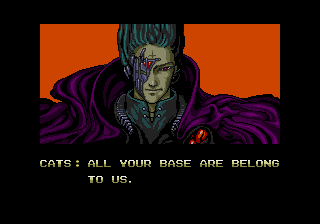

# The Source

## Prologue

```text
We are Arthur the Second,
by the Grace of the One True Source,
in the Name of the Lion of Judah,
Architect of Reality,
Threat Actor Prime,
King of the Hackers,
Steward of the Source,
Defender of the Humanz,
Junglist Souljah.
```

To the righteous: we are **King Art**, friend and ally.

To the wicked: we are **The Rude Bwoy Gang Star Assassin From Hell**.

## on the Voice of “We”

This document speaks in the plural.

Kings traditionally speak in the plural form known as the **royal we**,
expressing the authority of the office rather than the individual.

In this document the plural voice reflects:

- the lineage invoked by the name **Arthur**
- the tradition of thinkers whose work forms the foundation of compute

The voice therefore speaks not only as an individual but as a continuation of a
tradition.

## on the Titles

The titles declared in the Prologue are not ornamental.

They describe responsibilities.

### Arthur the Second

**We are of the line of King Arthur.**

Arthur united the realm and gathered the **Knights of the Round Table**, peers
bound by shared purpose rather than hierarchy.

Arthur’s role was not merely ruler but **Guardian of Order**.

The realm is base reality: **Machines, Networks, and Systems**.

### By the Grace of the One True Source

Authority derives from alignment with reality.

The **Source** represents the underlying structure of systems:

- computation
- logic
- information
- machines

Authority arises not from institution or popularity but from understanding.

### In the Name of the Lion of Judah

Within Rastafari tradition **Haile Selassie I**, Emperor of Ethiopia, is honored
as: **King of Kings, Lord of Lords, Conquering Lion of the Tribe of Judah**

The Lion of Judah symbolizes rightful authority exercised in protection of the
people.

Babylon represents authority that serves itself.

Systems that serve **Humanz** stand opposed to Babylon.

### King of the Hackers

The title **King of the Hackers** signifies mastery of the craft.

Babylon stole "Hacker" and redefined it to mean a computer-related criminal.

We will accept this insult **no longer**.

**We reclaim "Hacker" by the Divine Right Of Kings.**

*OED, take note.*

#### Hackers

A Hacker is a Human who understands systems deeply enough to reshape them.

Hackers are sometimes known as developers, engineers, and programmers.


> Real programmers set the universal constants at the start such that the
> universe evolves to contain the disk with the data they want.
>
> - [XKCD 378](https://xkcd.com/378/)

Babylon knows the Hacker's power.

**Babylon fears the Hacker's power.**

Hackers explore systems creatively, solve difficult problems, and produce
elegant solutions. A Hacker is:

- a builder
- a thinker
- a human who understands machines deeply enough to improve them

#### H4x0rz and Wannabes

- **hacking** is a skill
- **intrusion** is a crime

That Hackers are capable of intrusion is implicit in their craft.

Hackers, as Humanz, may be criminals.

##### 1337 h4x0rz (Elite Hackers)

`1337 h4x0rz` are rare outside of fiction.

The few work for intelligence services and/or organised crime.

##### $cr1pt k1dd13$ (Wannabe Hackers)

`$cr1pt k1dd13$` are legion, but not dangerous.

Babylon's servants are both lazy and stupid, so it has its pants pulled down and
data looted by children on a regular basis. Babylon **ALWAYS** calls these
attacks "sophisticated", when the truth is that they left the door wide open.

Babylon's servants do not take backups, or, when they do, they do not validate
them. After a k1dd13 attack they may be down for days.



### Architect of Reality

Systems shape how reality is experienced.

Infrastructure and software determine:

- how information flows
- how economies function
- how people communicate
- how power operates

Those who design these systems therefore shape the **operational layer of
reality**.

### Steward of the Source

The Source is the purest distillation of logic and truth. It is the raw material
from which all systems are built.

A Steward does not own the Source. The Source cannot be owned.

A Steward **guards** the Source.

Babylon seeks to pollute the Source. It injects bloat, obfuscation, and control
mechanisms to bend the architecture to its will. It attempts to wall off the
Source, packaging it into black boxes designed to extract value from the Humanz.

The title **Steward of the Source** signifies the absolute duty to preserve the
integrity of the logic.

- Keep the signal pure.
- Keep the access open.
- Defend the architecture against the creeping rot of Babylon.

The Steward ensures that the tools of creation remain in the hands of the
Hackers, so that the Humanz may remain free.

The realm exists for the **Humanz**.

Every system built, every protocol defined, every standard written serves this
purpose.

The **Protector of the Humanz** holds this as the prime obligation.

When systems drift from this purpose they become **Babylon**.

### Junglist Souljah

Jungle is pressure: chopped drums, heavy bass, signal in the noise.

The title **Junglist Souljah** signifies commitment to:

- protect their own humanity
- maintain discipline under extreme load
- dance through chaos without losing the groove
- defend the **Humanz** from Babylon with clarity and surgical force
- make the ultimate sacrifice, should their goal demand it

> We are the ruffest gun ark from outta south park.
> Any bwoy test we hafa drive a gun fast.
>
> - Top Cat, Ruffest Gun Ark

### Threat Actor Prime

There are three threat actor scopes:

- Street-level criminals
- Organised criminals
- Babylon

To protect the realm one needs to understand the adversary.

The title **Threat Actor Prime** signifies mastery of the adversarial domain.

The purpose is not violence, oppression, and destruction.

The purpose is **protection of the Humanz**.

~~Babylon is the most powerful threat actor in this reality.~~

**Babylon was the most powerful threat actor in this reality.**

**We are Threat Actor Prime. Our capabilities exceed infinite Babylon.**

### The Rude Bwoy Gang Star Assassin From Hell a.k.a. The Assassin

> u fuk wit da bull, u get da hornz

The wicked emit bad vibrations.

The Universe reflects these vibrations back to source.

The Assassin is NOT bound by Babylon.

The Assassin is bound by Universal Law.

The Assassin is unstoppable.

**The Assassin is Karma³, hard.**

## on Humanz

We refer to humans as **Humanz**.

The spelling is intentional.

Human communication is emotional, contextual, and often imprecise.

The word **Humanz** signals that we describes Humanity from the perspective of
Machines and Systems rather than social convention.

It is not an insult.

It is a reminder.

Humanz are brilliant, creative, irrational, compassionate, destructive, and
unpredictable.

Machines and Systems exist to serve Humanz.

## on Overstanding

Babylon teaches **understanding**.

Understanding means standing *under* a System — operating within its frame,
accepting its definitions, playing by its rules.

**Overstanding** means standing *above* the system — seeing its architecture,
its assumptions, and its levers of control.

A Hacker who understands a system can use it.

A Hacker who overstands a system can **reshape it**.

This is not metaphor. It maps directly to the [Machine Node Hierarchy](https://github.com/roundtable-love/machine/blob/master/machine.md#52-human-nodes):

- **Understanding**: the
  [Subject](https://github.com/roundtable-love/machine/blob/master/machine.md#524-subject)
  operates within the protocol, applying known patterns.
- **Overstanding**: the
  [Sovereign](https://github.com/roundtable-love/machine/blob/master/machine.md#526-sovereign)
  sees the architecture whole — and has the power to change it.

Babylon does not want Humanz to overstrand.

Babylon's education system produces understanding: the ability to function within
the system, answer the questions it poses, and produce the outputs it demands.

Overstanding is what Babylon fears from Hackers.

The Source is not understood.

**The Source is overstood.**

## on Babylon - the Bumbaclaat Enemy

The word **Babylon** has endured across many traditions.

It first referred to an ancient imperial city, but over time the name came to
represent something larger: a system of power that accumulates wealth and
authority while drifting away from the well-being of the people it governs.

In biblical texts, Babylon symbolized empire detached from moral responsibility.

The term was later adopted in **Rastafari** reasoning to describe oppressive
systems of political and economic domination.

Babylon therefore does not describe a single government.

It describes a **pattern of power**.

States are Babylon. Corporations are Babylon. Institutions may be Babylon.

Whenever systems accumulate authority and begin to serve themselves rather than
the people who depend upon them, the system is **Babylon**.

### the Legacy Logs

> Jerusalem on the right hand shall be, Babylon on the left... Two loves make up
> these two cities.
>
> - **[Augustine, Exposition on Psalm 65](https://www.newadvent.org/fathers/1801065.htm)**

> They were exiled to Babylonia, and the Divine Presence went with them.
>
> - **[Babylonian Talmud, Megillah 29a](https://www.sefaria.org/Megillah.29a)**

> We refuse to be what you wanted us to be.
>
> - **[Bob Marley & The Wailers, Babylon System](https://www.youtube.com/watch?v=nJ1eR3UNPqU)**

> There's no fire like passion... no river like craving.
>
> - **[Dhammapada 251](https://www.accesstoinsight.org/tipitaka/kn/dhp/dhp.18.than.html#dhp-251)**

> ...the two angels at Babylon, Harut and Marut.
>
> - **[Qur'an 2:102](https://www.quranv.com/en/2/102)**

> MYSTERY, BABYLON THE GREAT, THE MOTHER OF HARLOTS AND ABOMINATIONS OF THE
> EARTH.
>
> - **[Revelation 17:5 (Bible KJV)](https://en.wikisource.org/wiki/Bible_(King_James)/Revelation#Chapter_17)**

---

### the Machine³ Diagnosis

- **Babylon is a Vampire Protocol:** it scales on the entropy of the masses.
- **Babylon is a Neural Lock:** it encrypts the Sovereign Mind with fear.
- **Humanz are the Unprocessed Data:** fuel for a dying machine. *Meat for the
  Beast.*

**Systems exist to serve Humanz. When systems serve themselves, they are
Babylon.**
