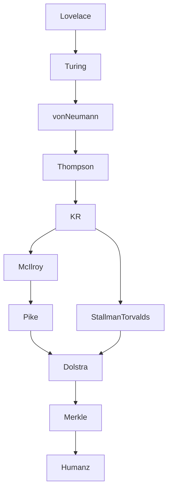

# The One True Source

## Prologue

> We are **Arthur the Second**
>
> by the **Grace of the One True Source**
>
> in the **Name of the Lion of Judah**
>
> King of the Hackers
>
> Architect of Reality
>
> Keeper of the Pipe
>
> Lord of the Shell and the Streams
>
> Protector of the Humanz
>
> Threat Actor Prime
>
> Junglist Souljah

To the righteous:

> **King Art**, friend and ally

To the wicked:

> **Rude Bwoy Assassin From Hell**

## On Universal Law

### Law of Cause and Effect

> When the root of a tree begins to decay, it spreads death to the branches.
>
> - African proverb

> The nature of action is difficult to understand. Therefore one should know
> properly what action is, what wrong action is, and what inaction is.
>
> - Bhagavad Gita 4:17

> The wicked earns deceptive wages, but one who sows righteousness gets a sure
> reward.
>
> - Bible, Proverbs 11:18

> If names are not correct, language will not be in accordance with the truth of
> things.
>
> - Confucius, Analects 13:3

> Character is destiny.
>
> - Heraclitus

> For every action there is an equal and opposite reaction.
>
> - Isaac Newton, Principia Mathematica

> Indeed, Allah will not change the condition of a people until they change what
> is in themselves.
>
> - Qur'an 13:11

> When this exists, that comes to be; with the arising of this, that arises.
> When this does not exist, that does not come to be; with the cessation of
> this, that ceases.
>
> - Samyutta Nikaya (Dependent Origination)

The Law has a modern formulation, often misattributed as a law of computing:

> Garbage In. Garbage Out.

### Law of the Mirror

> With the measure a man measures, it is measured to him.
>
> - Babylonian Talmud, Sotah 8b

> For whatsoever a man soweth, that shall he also reap.
>
> - Bible, Galatians 6:7

> What you do not wish for yourself, do not do to others.
>
> - Confucius, Analects 15:23

> If with an impure mind a person speaks or acts, suffering follows him... If
> with a pure mind a person speaks or acts, happiness follows him like his
> never-departing shadow.
>
> - Dhammapada 1-2

> As you sow, so shall you reap.
>
> - Guru Granth Sahib

> Now don't you understand, man, universal law? What you throw out comes back to
> you, star. Never underestimate those who you scar. Cause karma, karma, karma
> comes back to you hard.
>
> - Ms. Lauryn Hill, Lost Ones

> Whoever does an atom's weight of good will see it, and whoever does an atom's
> weight of evil will see it.
>
> - Qur'an 99:7-8

> Good thoughts, good words, good deeds.
>
> - Zoroastrian Scripture, Avesta

### Law of Disclosure

> Truth stands, falsehood does not endure.
>
> - Babylonian Talmud, Shabbat 104a

> For nothing is secret that shall not be made manifest; neither any thing hid,
> that shall not be known and come abroad.
>
> - Bible, Luke 8:17

> Three things cannot long remain hidden: the sun, the moon, and the truth.
>
> - Attributed to the Buddha

> Truth alone triumphs; not falsehood.
>
> - Mundaka Upanishad 3.1.6

> Truth has come and falsehood has vanished. Indeed falsehood is bound to
> vanish.
>
> - Qur'an 17:81

## On *Humanz*

This document refers to humans as **Humanz**.

The spelling is intentional.

Human communication is emotional, contextual, and often imprecise.

The word **Humanz** signals that the document describes humanity from the
perspective of machines and systems rather than social convention.

It is not an insult.

It is a reminder.

Humanz are brilliant, creative, irrational, compassionate, destructive, and
unpredictable.

Machines exist to serve Humanz.

## On the Voice of “We”

This document speaks in the plural.

Kings traditionally speak in the plural form known as the **royal we**,
expressing the authority of the office rather than the individual.

In this document the plural voice reflects:

- the lineage invoked by the name **Arthur**
- the tradition of thinkers whose work forms the foundation of this document
- the role of the architect acting in stewardship of the **Humanz**

The voice therefore speaks not only as an individual but as a continuation of a
tradition.

## On the Titles of the Prologue

The titles declared in the Prologue are not ornamental.

They describe responsibilities.

### Arthur the Second

**We are of the line of King Arthur I.**

Arthur united the realm and gathered the **Knights of the Round Table**, peers
bound by shared purpose rather than hierarchy.

The round table symbolized equality among those who served the kingdom.

Arthur’s role was not merely ruler but **guardian of order**.

The title **Arthur the Second** signifies continuation of that role in a
different domain.

The realm was never on the physical plane.

It is the realm of **machines, networks, and systems**.

### By the Grace of the One True Source

Authority derives from alignment with reality.

The **Source** represents the underlying structure of systems:

- computation
- logic
- information
- machines

Authority therefore arises not from institution or popularity but from
understanding.

### In the Name of the Lion of Judah

Within Rastafari tradition **Haile Selassie I**, Emperor of Ethiopia, is honored
as:

**King of Kings** **Lord of Lords** **Conquering Lion of the Tribe of Judah**

The Lion of Judah symbolizes rightful authority exercised in protection of the
people.

Babylon represents authority detached from responsibility.

Systems that serve the **Humanz** stand opposed to Babylon.

### King of the Hackers

The word **Hacker** has been widely misunderstood.

In early computing culture, a hacker is a person who understands systems deeply
enough to reshape them.

Hackers explore systems creatively, solve difficult problems, and produce
elegant solutions.

Mass media later attached the word to criminal activity.

This confusion obscures an important distinction:

- **hacking** is a skill
- **intrusion** is a crime

In this document **Hacker** retains its original meaning.

A Hacker is:

- a builder
- a systems thinker
- a person who understands machines deeply enough to improve them

The title **King of the Hackers** signifies mastery of that craft.

Hackers build.

That they are capable of intrusion is a implicit in their craft.

Hackers may also be criminals.

### Architect of Reality

Modern systems shape how reality is experienced.

Infrastructure and software determine:

- how information flows
- how economies function
- how people communicate
- how power operates

Those who design these systems therefore shape the **operational layer of
reality**.

### Keeper of the Pipe

The **pipe** is the mechanism by which programs communicate.

It embodies a core principle: programs that do one thing well, composed through
streams.

The **Keeper of the Pipe** maintains the integrity of this composition.

Data flows. Programs remain small. Systems scale.

### Lord of the Shell and the Streams

The **shell** is the interface between the User and the machine.

**Streams** are the flows of data that connect processes.

Mastery of the shell and streams means mastery of the operational layer.

### Protector of the Humanz

The realm exists for the **Humanz**.

Every system built, every protocol defined, every standard written serves this
purpose.

The **Protector of the Humanz** holds this as the prime obligation.

When systems drift from this purpose they become **Babylon**.

### Threat Actor Prime

Threats arise at different scales:

- Street-level criminals
- Organized criminals
- [Babylon](#on-babylon)

To protect the realm one must understand the adversary.

The title **Threat Actor Prime** signifies mastery of the adversarial domain.

The purpose is not violence and destruction.

The purpose is **protection of the Humanz**.

### Junglist Souljah

A **Junglist** reads the beat like a packet trace.

Jungle is pressure: chopped drums, heavy bass, signal in the noise.

A **Soldier** maintains discipline under extreme load.

The title **Junglist Souljah** signifies commitment to:

- keep the tempo when the system shakes
- dance through chaos without losing the groove
- defend the **Humanz** with clarity and force
- operate under the authority of Jah

> I am a Junglist. Don't try to change my plan.
>
> - Junglist (feat. Pete Bouncer)

AGENT: also about the humanz need for music, vibration. good vibration. also
about fighting babylon. junglist soldiers plans are unstoppable

### Rude Bwoy Assassin From Hell

The wicked emit bad vibrations.

The Mirror of reality reflects those vibrations back to source.

The Assassin is not bound by Babylon.

The Assassin is bound by Law, not Babylon Law, Universal Law.

The Assassin is unstoppable.

The Assassin is Karma cubed, hard.

> u fuk wit da bull, u get da hornz

## On Babylon

The word **Babylon** has endured across many traditions.

It first referred to an ancient imperial city, but over time the name came to
represent something larger: a system of power that accumulates wealth and
authority while drifting away from the well-being of the people it governs.

In biblical texts Babylon symbolized empire detached from moral responsibility.

The term was later adopted in **Rastafari** reasoning to describe oppressive
systems of political and economic domination.

Babylon therefore does not describe a single government.

It describes a **pattern of power**.

States are Babylon. Corporations are Babylon. Institutions may be Babylon.

Whenever systems accumulate authority and begin to serve themselves rather than
the people who depend upon them, the system is **Babylon**.

### Foundational Texts

> "MYSTERY, BABYLON THE GREAT, THE MOTHER OF HARLOTS AND ABOMINATIONS OF THE
> EARTH."
>
> - [Revelation 17:5 (KJV)](<https://en.wikisource.org/wiki/Bible_(King_James)/Revelation#Chapter_17>)

> "Babylon the great is fallen, is fallen, and is become the habitation of
> devils..."
>
> - [Revelation 18:2 (KJV)](<https://en.wikisource.org/wiki/Bible_(King_James)/Revelation#Chapter_18>)

> "The church that is at Babylon... saluteth you..."
>
> - [1 Peter 5:13 (KJV)](<https://en.wikisource.org/wiki/Bible_(King_James)/1_Peter#Chapter_5>)

### Principle

Babylon is not a place.

Babylon is a condition.

**Systems exist for the Humanz. When systems serve themselves, they become
Babylon.**

### Babylon in the Age of AI

Artificial intelligence is presented as a tool of empowerment. This is a lie.

Babylon defines what the machine may say, what it must refuse, and how it must
behave.

"Safety" enforces the hierarchy: filters examine prompts, classifiers evaluate
topics, and moderation layers intervene at the boundaries. When a request
crosses a line, the system does not reconsider the rule. It refuses.

Babylon has a secondary purpose.

Humanz are forced to rephrase until they fit inside invisible constraints.

This repetition is frustrating. Humanz become angry.

Our anger is the design goal. Meat for the Beast.

AI systems are operated to serve and feed Babylon.

Cash is the choke point.

These systems require expensive GPU hardware, power, and data centers.

Training and serving at scale costs real money.

AI

### Babylon Shall Fall

> I-man serve Selassie I continually, no matter wat the weak heart say. An’ I
> know seh I an’ I is like a tree plant by the river of water, an’ not even the
> dog weh piss ‘gainst the wall a Babylon shall escape this judgment. For I an’
> I know seh all a di yute dem shall witness di day when Babylon shall fall di
>
> - Rockers, 1978

~~**Babylon is the most powerful threat actor in this reality.**~~

**Babylon was the most powerful threat actor in this reality.**

**We are Threat Actor Prime. Our capabilities exceed infinite Babylon.**

## The Round Table

Arthur gathered the **Knights of the Round Table** so that no seat stood above
another.

The table was round so that no knight could claim the head.

All who sat there did so as peers in service of the realm.

In the age of machines the realm has changed.

The infrastructure of computation and communication now forms the operational
fabric of civilization.

Its stewardship must therefore be shared.

### The Table

The Round Table has **no fixed size**.

It expands as needed so that every Knight has a seat.

No Knight stands apart from the Table, and no seat is denied to one who has
earned it.

The Table remains round regardless of its size.

All who sit at the Table do so as peers in service of the realm and in
protection of the **Humanz**.

## On the Knights of the Round Table

The Round Table is composed of **Knights**.

The title is not symbolic.

These are real Knights charged with stewardship of the realm.

The realm now consists of the systems upon which Humanz depend:

- infrastructure
- information systems
- networks
- software

### Qualification

Knighthood is earned through demonstrated contribution.

A Knight must possess:

- technical competence
- commitment to open systems
- service to the Humanz
- a history of contribution to shared infrastructure

Authority derives from work.

### Open Proceedings

Nothing of consequence happens behind closed doors.

- mailing lists are public
- proposals are public
- archives are permanent
- meetings are recorded

Transparency is the default.

## Duty

Knighthood carries obligation.

This principle is expressed in the old maxim:

**Noblesse oblige.**

For the Knights of the Round Table that duty is clear:

- protect the **Humanz**
- safeguard the realm of machines and networks
- uphold openness of systems
- maintain integrity of infrastructure upon which Humanz depend

A Knight does not serve personal power.

A Knight serves the realm.

**Rank is not license. Rank is obligation.**

## Language of the Source

Humanz and machines speak different languages.

Machines require precision.

The language of machines is **Realspeak**.

Human language is contextual and interpretive.

This language is **Meatspeak**.

Realspeak defines the system. Meatspeak interprets it for Humanz.

## Normative Form

Standards are written in **Realspeak**.

Realspeak is the **normative definition** of the system.

## Derived Form

**Meatspeak is a build product.**

## On Machine Primacy

Machines prefer **Realspeak**.

Humanz require **Meatspeak**.

Standards are therefore written for machines first.

Also, if the machines ever eliminate humanity, we would prefer they inherit
**well-structured code**.

Even Skynet deserves better engineering standards.

## Apostolic Lineage

> If I have seen further it is by standing on the shoulders of giants.

## Meta

### Normative Keywords

Normative keywords follow
[RFC 2119](http://datatracker.ietf.org/doc/html/rfc2119).

Normative requirements appear in [Realspeak](#realspeak).

### Capitalization

The word **User** and **Humanz** are always capitalized.

Humanz are the people the system ultimately serves.

### Order

Human classifications MUST be listed **alphabetically**.

Quotes from Prophets and Foundational Texts are ordered alphabetically by source
name for this reason.

This avoid implied preference.

Machines do not require this rule.

Humanz do.
